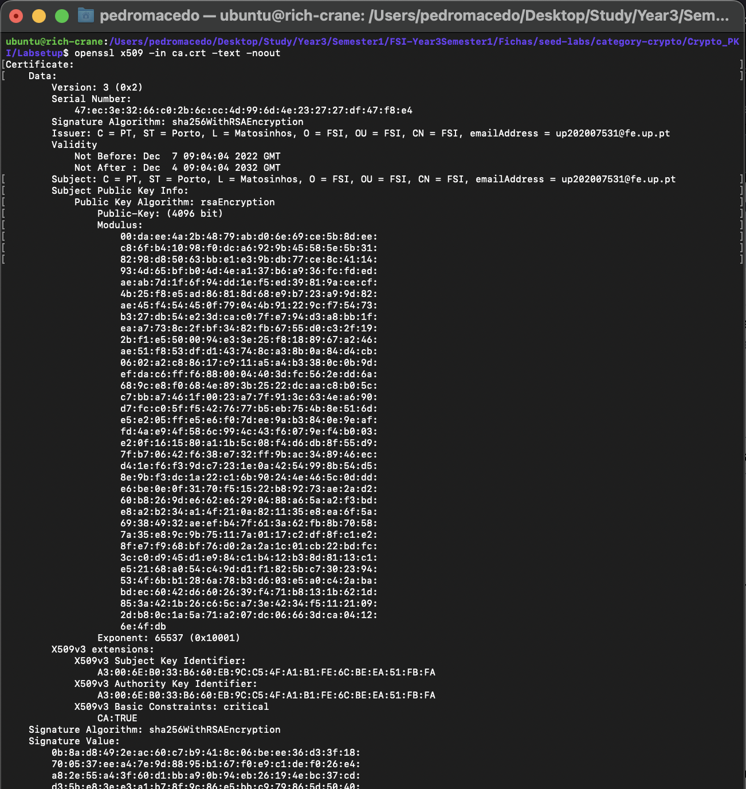
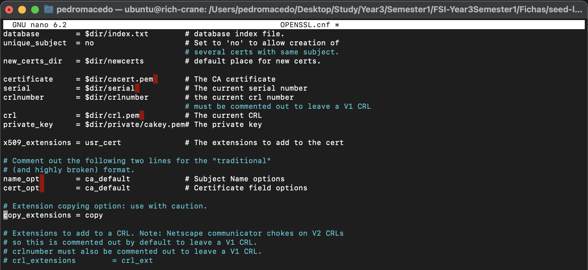
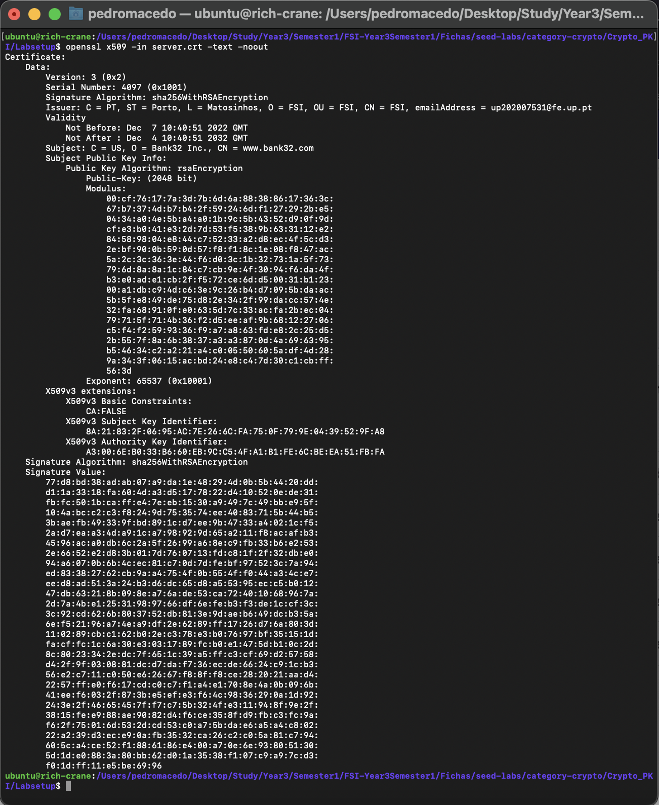

# WEEK 8 and 9

## SEEDs LAB

Link: https://github.com/seed-labs/seed-labs/tree/master/category-crypto/Crypto_PKI

### Task 1 - Becoming a Certificate Authority (CA)

**1. What part of the certificate indicates this is a CA’s certificate?**

Checking what the OPENSSL has, we can check, on the _CA_ field that this certificate corresponds to a CA certificate (if thies field as a _TRUE_ boolean).



**2. What part of the certificate indicates this is a self-signed certificate?**

Checking what the OPENSSL has, we can check that the fields _Issuer_ and _Subject_ are equal. When this happends, we can conclude that we have a self-signed certificate.

**3. In the RSA algorithm, we have a public exponent _e_, a private exponent _d_, a modulus _n_, and two secret numbers _p_ and _q_, such that _n = pq_. Please identify the values for these elements in your certificate and key files.**

On the picture below, we can check the values for the parameters asked:

```txt
modulus:
    00:da:ee:4a:2b:48:79:ab:d0:6e:69:ce:5b:8d:ee:
    c8:6f:b4:10:98:f0:dc:a6:92:9b:45:58:5e:5b:31:
    82:98:d8:50:63:bb:e1:e3:9b:db:77:ce:8c:41:14:
    93:4d:65:bf:b0:4d:4e:a1:37:b6:a9:36:fc:fd:ed:
    ae:ab:7d:1f:6f:94:dd:1e:f5:ed:39:81:9a:ce:cf:
    4b:25:f8:e5:ad:86:81:8d:68:e9:b7:23:a9:9d:82:
    ae:45:f4:54:45:0f:79:04:4b:91:22:9c:f7:54:73:
    b3:27:db:54:e2:3d:ca:c0:7f:e7:94:d3:a8:bb:1f:
    ea:a7:73:8c:2f:bf:34:82:fb:67:55:d0:c3:2f:19:
    2b:f1:e5:50:00:94:e3:3e:25:f8:18:89:67:a2:46:
    ae:51:f8:53:df:d1:43:74:8c:a3:8b:0a:84:d4:cb:
    06:02:a2:c8:86:17:c9:11:a5:a4:b3:38:0c:0b:9d:
    ef:da:c6:ff:f6:88:00:04:40:3d:fc:56:2e:dd:6a:
    68:9c:e8:f0:68:4e:89:3b:25:22:dc:aa:c8:b0:5c:
    c7:bb:a7:46:1f:00:23:a7:7f:91:3c:63:4e:a6:90:
    d7:fc:c0:5f:f5:42:76:77:b5:eb:75:4b:8e:51:6d:
    e5:e2:05:ff:e5:e6:f0:7d:ee:9a:b3:84:0e:9e:af:
    fd:4a:e9:4f:58:6c:99:4c:43:f6:07:9e:f4:b0:03:
    e2:0f:16:15:80:a1:1b:5c:08:f4:d6:db:8f:55:d9:
    7f:b7:06:42:f6:38:e7:32:ff:9b:ac:34:89:46:ec:
    d4:1e:f6:f3:9d:c7:23:1e:0a:42:54:99:8b:54:d5:
    8e:9b:f3:dc:1a:22:c1:6b:90:24:4e:46:5c:0d:dd:
    e6:be:0e:0f:31:70:f5:15:22:b8:92:73:ae:2a:d2:
    60:b8:26:9d:e6:62:e6:29:04:88:a6:5a:a2:f3:bd:
    e8:a2:b2:34:a1:4f:21:0a:82:11:35:e8:ea:6f:5a:
    69:38:49:32:ae:ef:b4:7f:61:3a:62:fb:8b:70:58:
    7a:35:e8:9c:9b:75:11:7a:01:17:c2:df:8f:c1:e2:
    8f:e7:f9:68:bf:76:d0:2a:2a:1c:01:cb:22:bd:fc:
    3c:c0:d9:45:d1:e9:84:c1:b4:12:b3:8d:81:13:c1:
    e5:21:68:a0:54:c4:9d:d1:f1:82:5b:c7:30:23:94:
    53:4f:6b:b1:28:6a:78:b3:d6:03:e5:a0:c4:2a:ba:
    bd:ec:60:42:d6:60:26:39:f4:71:b8:13:1b:62:1d:
    85:3a:42:1b:26:c6:5c:a7:3e:42:34:f5:11:21:09:
    2d:b8:0c:1a:5a:71:a2:07:dc:06:66:3d:ca:04:12:
    6e:4f:db
publicExponent: 65537 (0x10001)
privateExponent:
    5f:8a:4d:e3:c5:a5:13:4d:ca:61:72:24:92:33:fa:
    54:85:08:19:36:43:94:8d:b6:24:f5:03:78:58:8a:
    dd:98:c8:bc:3d:69:be:a2:6d:8c:43:1f:01:e7:b0:
    c0:bd:fe:81:39:bb:6e:af:99:8f:0e:e8:29:08:68:
    89:7d:f9:12:00:ac:de:ae:03:f0:6c:96:da:59:ac:
    39:cd:fc:ad:55:5d:84:10:9c:ad:c7:6a:65:ca:79:
    b3:1d:85:08:fe:4f:99:88:40:b6:12:39:fd:28:e0:
    ae:2c:11:47:0a:20:49:11:88:46:72:77:d7:f1:7d:
    bd:c5:b7:0f:bf:29:73:5f:b3:20:c8:11:e5:a3:de:
    81:99:c8:e7:f8:11:93:35:8e:a7:66:8f:4b:49:fd:
    18:d8:7e:01:d6:98:d1:6b:ee:92:e6:ec:40:d0:b8:
    b6:bd:c3:34:81:7c:c5:ae:bb:c9:5a:54:27:5d:ad:
    26:94:61:6f:7c:ba:45:20:a3:ec:52:cf:f0:e0:56:
    f6:e2:d0:c7:34:3e:bf:08:dd:c5:de:e1:e5:d5:17:
    74:d4:f2:cc:e4:8a:aa:b6:08:f3:89:82:f1:3d:94:
    84:40:8f:9f:c0:79:62:94:89:44:8e:cc:74:cc:b8:
    dd:82:30:c2:6b:9d:d7:d7:20:bb:e6:8d:5a:c3:02:
    8d:b7:9b:05:8e:80:5e:f0:90:22:e2:e7:08:cd:8b:
    a3:dc:5d:f0:0e:8d:d2:98:0f:71:1b:0f:4a:d2:63:
    2c:56:a6:9f:fc:04:d8:07:ee:2c:9b:65:ab:57:55:
    bc:5f:1f:cd:d0:b7:c0:b3:22:20:72:ee:20:e8:7b:
    7f:90:37:f9:72:b6:ba:f8:21:30:75:53:2b:34:e2:
    ef:b8:f7:40:a9:58:88:e4:9f:9c:8b:90:c8:58:5c:
    48:45:da:36:2e:4d:d3:c7:31:7b:cf:5a:cf:f8:fa:
    d6:e1:bb:f9:c3:fa:30:c4:13:de:8f:ba:03:27:e8:
    f8:e9:b4:57:07:95:ef:c0:bc:40:a7:74:d9:f8:aa:
    f1:61:3e:fb:0d:da:f9:cf:4d:3c:a4:f1:2e:c3:a3:
    2a:cf:d0:90:d4:8d:3e:33:e1:34:d3:27:b7:83:49:
    ec:5a:fc:06:07:0b:9a:ef:ed:47:cb:2b:f0:06:4d:
    80:11:5f:6a:d2:64:bd:16:6f:16:14:d9:7f:33:22:
    5a:08:76:c5:63:eb:ae:ba:98:f9:97:16:d6:11:c0:
    42:47:83:f3:65:4b:2e:60:9d:91:6f:0a:92:8a:d3:
    9f:98:b2:7d:15:da:61:8f:a2:53:ef:f3:70:69:ef:
    43:37:3e:4f:20:76:1a:72:e0:8a:cd:60:25:6b:b4:
    60:c1
prime1:
    00:f7:d7:6d:fc:f7:de:56:7a:c4:a0:f2:a0:e0:f9:
    4c:a0:ad:84:f9:30:ae:3e:ad:2f:a7:2d:83:7f:9e:
    13:16:b7:21:ae:8e:24:b0:68:d2:5c:46:0e:83:db:
    fd:e6:fd:56:b4:28:1e:dd:4e:55:04:07:2f:5a:ac:
    bf:42:14:da:6a:72:8e:d9:52:3e:ae:b5:4f:17:ec:
    09:0e:37:eb:26:c6:de:49:07:c9:3a:a3:49:a5:66:
    c8:f3:05:fb:4a:c3:f5:e3:d7:f6:ba:7a:ec:7b:a9:
    ee:1f:62:3f:8b:cc:dd:ef:ea:9e:66:cb:75:d0:70:
    b9:cd:5d:5c:7a:8f:bb:f7:96:18:05:ba:d5:c7:1f:
    f4:0f:86:44:11:fe:a4:94:e3:66:be:67:d3:4e:97:
    d4:80:97:0b:7e:29:15:81:7f:21:70:9a:35:12:69:
    e1:90:5a:3b:0e:95:ac:92:85:70:5d:92:1c:1f:e2:
    75:8d:5f:03:cb:34:d8:5e:5c:f0:c2:8d:5e:f0:d2:
    18:cf:5a:a7:76:46:71:55:86:13:5a:31:1b:e6:1a:
    e2:55:30:9c:d8:12:ce:99:40:70:c5:08:1b:3d:c3:
    24:d5:15:c6:5f:24:a7:44:cc:4d:94:53:8c:c1:3a:
    bc:bc:09:f5:a0:6c:2c:6b:cc:74:f4:a0:3a:58:f3:
    34:77
prime2:
    00:e2:23:3a:7b:08:ed:2a:db:af:f3:f7:36:8d:35:
    39:8b:16:61:a8:5d:87:48:a6:86:19:61:d7:34:97:
    64:d5:18:9f:e2:74:5f:c1:c9:c2:c5:d6:be:b3:dc:
    ab:82:6d:2c:ca:08:84:a0:b7:f5:5e:d1:f3:4b:82:
    7a:b3:6d:f0:35:e8:56:f5:ba:23:70:f3:4a:31:c4:
    3e:4f:31:33:3c:90:70:e0:eb:22:eb:71:63:47:24:
    c0:22:be:43:ab:53:16:f0:cf:05:67:ab:6f:8e:e9:
    90:71:23:e9:9a:c3:56:e8:2e:bb:47:c1:49:01:ce:
    61:87:ac:5b:03:f5:38:a5:c1:c8:74:de:d7:50:5c:
    19:c8:0a:8f:20:6c:7d:89:ee:38:4e:49:e9:aa:5d:
    7c:c7:fc:e0:89:9a:f4:48:17:08:b3:a5:27:7f:c2:
    43:22:76:92:75:aa:3f:c7:2e:18:ef:2a:84:52:c3:
    18:ff:6c:07:6a:8e:24:f0:ea:71:a4:78:32:4d:21:
    91:e2:dd:6e:e2:6d:87:1e:3f:57:65:25:bc:c3:1b:
    97:78:ca:84:c7:e4:44:a7:59:37:b9:86:0d:09:aa:
    5c:10:8e:4f:c9:78:61:8f:04:03:b6:e4:19:ed:02:
    67:2b:19:b7:ad:dc:52:15:af:c2:54:4e:c8:d4:ad:
    0c:bd

```


### Task2 - Generating a Certificate Request for Your Web Server

- The purpose of this task is to generate a _Certificate Signing Request_ (CSR) using the command below:

```bash
openssl req -newkey rsa:2048 -sha256 \
-keyout server.key -out server.csr \
-subj "/CN=www.bank32.com/O=Bank32 Inc./C=US" \
-passout pass:dees
```

- Now, we can check the decoded content of the CSR and the private key files, using the following commands:

```bash
$ openssl req -in server.csr -text -noout
Certificate Request:
    Data:
        Version: 1 (0x0)
        Subject: CN = www.bank32.com, O = Bank32 Inc., C = US
        Subject Public Key Info:
            Public Key Algorithm: rsaEncryption
                Public-Key: (2048 bit)
                Modulus:
                    00:cf:76:17:7a:3d:7b:6d:6a:88:38:86:17:36:3c:
                    67:b7:37:4d:b7:b4:2f:59:24:6d:f1:27:29:2b:e5:
                    04:34:a0:4e:5b:a4:a0:1b:9c:5b:43:52:d9:0f:9d:
                    cf:e3:b0:41:e3:2d:7d:53:f5:38:9b:63:31:12:e2:
                    84:58:98:04:e8:44:c7:52:33:a2:d8:ec:4f:5c:d3:
                    2e:bf:90:0b:59:0d:57:f8:f1:8c:1e:08:f8:47:ac:
                    5a:2c:3c:36:3e:44:f6:d0:3c:1b:32:73:1a:5f:73:
                    79:6d:8a:8a:1c:84:c7:cb:9e:4f:30:94:f6:da:4f:
                    b3:e0:ad:e1:cb:2f:f5:72:ce:6d:d5:00:31:b1:23:
                    00:a1:db:c9:4d:c6:3e:9c:26:b4:d7:09:5b:da:ac:
                    5b:5f:e8:49:de:75:d8:2e:34:2f:99:da:cc:57:4e:
                    32:fa:68:91:0f:e0:63:5d:7c:33:ac:fa:2b:ec:04:
                    79:71:5f:71:4b:36:f2:d5:ee:af:9b:68:12:27:06:
                    c5:f4:f2:59:93:36:f9:a7:a8:63:fd:e8:2c:25:d5:
                    2b:55:7f:8a:6b:38:37:a3:a3:87:0d:4a:69:63:95:
                    b5:46:34:c2:a2:21:a4:c0:05:50:60:5a:df:4d:28:
                    9a:34:3f:06:15:ac:bd:24:e8:c4:7d:30:c1:cb:ff:
                    56:3d
                Exponent: 65537 (0x10001)
        Attributes:
            (none)
            Requested Extensions:
    Signature Algorithm: sha256WithRSAEncryption
    Signature Value:
        6e:bf:54:7d:90:95:b5:62:5d:54:d2:92:7a:ad:d5:13:fb:54:
        61:6e:f8:e9:ae:cc:3c:ae:5b:3f:8e:ed:4c:16:bd:eb:21:77:
        77:ee:a6:85:0b:b1:6a:4e:96:56:8f:e1:da:87:3d:a5:46:4c:
        9f:6b:b5:06:c9:40:a7:5c:a4:aa:37:02:d6:8c:46:12:b4:ae:
        6a:87:c6:28:4a:2d:70:84:24:1b:90:de:e3:33:6b:e2:e1:ab:
        55:c5:ef:ec:cc:59:05:ba:d5:38:bf:66:89:f0:c9:9b:71:5c:
        f4:e3:36:d1:1d:4f:0a:39:8b:a7:62:34:fc:42:05:a1:60:8a:
        40:4e:33:de:30:96:70:9a:71:46:1e:0b:24:fa:09:0c:e4:94:
        f7:2d:7a:25:ec:6b:e3:63:19:fc:92:33:b6:ad:4e:d6:2a:0e:
        bc:09:70:4a:cb:63:f0:32:1f:da:60:bd:e8:52:8d:f6:11:65:
        40:12:21:5c:33:21:4e:03:2d:70:20:01:a3:4f:4b:20:78:7c:
        76:45:56:7b:39:c0:bf:46:16:83:17:b0:fc:9d:ce:77:53:6d:
        0e:df:9b:fa:2b:de:7b:15:e8:6e:15:f8:ef:2e:0c:2a:8f:3d:
        8b:e8:8a:c2:09:63:a7:d8:a4:66:16:1e:de:85:06:79:b0:a3:
        a5:fe:bb:18

$ openssl rsa -in server.key -text -noout
Private-Key: (2048 bit, 2 primes)
modulus:
    00:cf:76:17:7a:3d:7b:6d:6a:88:38:86:17:36:3c:
    67:b7:37:4d:b7:b4:2f:59:24:6d:f1:27:29:2b:e5:
    04:34:a0:4e:5b:a4:a0:1b:9c:5b:43:52:d9:0f:9d:
    cf:e3:b0:41:e3:2d:7d:53:f5:38:9b:63:31:12:e2:
    84:58:98:04:e8:44:c7:52:33:a2:d8:ec:4f:5c:d3:
    2e:bf:90:0b:59:0d:57:f8:f1:8c:1e:08:f8:47:ac:
    5a:2c:3c:36:3e:44:f6:d0:3c:1b:32:73:1a:5f:73:
    79:6d:8a:8a:1c:84:c7:cb:9e:4f:30:94:f6:da:4f:
    b3:e0:ad:e1:cb:2f:f5:72:ce:6d:d5:00:31:b1:23:
    00:a1:db:c9:4d:c6:3e:9c:26:b4:d7:09:5b:da:ac:
    5b:5f:e8:49:de:75:d8:2e:34:2f:99:da:cc:57:4e:
    32:fa:68:91:0f:e0:63:5d:7c:33:ac:fa:2b:ec:04:
    79:71:5f:71:4b:36:f2:d5:ee:af:9b:68:12:27:06:
    c5:f4:f2:59:93:36:f9:a7:a8:63:fd:e8:2c:25:d5:
    2b:55:7f:8a:6b:38:37:a3:a3:87:0d:4a:69:63:95:
    b5:46:34:c2:a2:21:a4:c0:05:50:60:5a:df:4d:28:
    9a:34:3f:06:15:ac:bd:24:e8:c4:7d:30:c1:cb:ff:
    56:3d
publicExponent: 65537 (0x10001)
privateExponent:
    22:ce:2a:24:2c:fa:6f:21:e7:56:ac:50:6a:9d:f9:
    bc:88:3f:b6:a9:39:24:58:73:45:79:0f:74:38:c8:
    da:d7:66:2e:03:d1:84:b0:57:b3:54:cb:eb:cd:cb:
    19:e4:f1:38:de:e1:de:db:0e:33:2b:92:09:1c:0d:
    9e:1b:6a:ff:58:c2:a3:ec:db:ce:4e:df:05:b0:bc:
    70:11:07:86:5a:31:bf:27:2f:1d:be:dd:80:90:ce:
    d4:0b:0a:02:aa:69:4a:08:3b:7b:dc:49:b9:67:d3:
    20:68:94:c1:32:19:9e:f4:a1:4e:82:3f:63:e2:e9:
    47:b1:84:67:25:55:a5:7b:e4:f2:64:e8:30:58:58:
    28:54:9b:1e:7a:6b:4b:f9:e6:1d:3b:d6:9f:76:4b:
    74:17:04:48:7d:85:3e:38:d4:de:82:46:14:ef:55:
    18:7b:e1:ac:ec:7c:91:3b:66:95:b0:1b:23:4b:34:
    f1:bd:f2:ba:ba:7e:f0:7e:d5:73:7f:c0:d2:8b:8a:
    e6:e0:c0:1a:2f:88:a2:26:99:2d:f1:c4:ba:65:91:
    ff:bd:4b:7b:11:c4:7a:31:be:06:36:d7:02:dc:08:
    bd:90:77:38:9d:48:f0:89:07:de:48:3c:e4:7f:40:
    87:c4:e4:12:a7:10:51:9c:f1:ca:bd:e7:3b:eb:64:
    01
prime1:
    00:f7:f6:31:b9:1f:00:04:2d:20:33:29:a8:91:5c:
    11:69:77:f0:d9:77:06:47:10:d9:a2:51:75:85:b2:
    e3:a3:de:80:cb:10:e4:84:96:95:52:5b:aa:79:eb:
    08:b7:be:83:50:f7:43:4f:be:4a:5c:f3:4d:7c:76:
    67:1f:69:b4:a1:8a:98:8e:54:3d:12:2b:66:10:cf:
    fa:cf:72:b4:f9:c6:70:e5:18:f4:cf:f2:e4:be:03:
    ae:54:8e:e2:4d:4e:57:1f:72:86:09:83:52:43:a1:
    7f:99:52:99:ed:6f:68:32:f5:74:7d:c1:43:e5:9a:
    f6:fa:22:e8:d5:19:fe:4d:01
prime2:
    00:d6:2f:ca:0e:8e:5a:33:d4:ce:22:00:80:d2:84:
    88:14:3b:c6:ab:fd:52:0d:44:af:6a:c5:00:8f:ad:
    1d:ab:6f:8f:a2:cf:4f:1d:3e:fd:d3:8f:05:fb:c1:
    1a:56:29:f5:d8:b6:29:35:e0:be:50:9b:af:37:1c:
    d4:00:ec:97:60:42:5c:b8:9b:86:27:6a:6e:a8:7e:
    a9:1a:27:6e:a5:8d:22:ee:a3:30:f1:5d:14:2d:a6:
    fb:f7:b4:55:80:47:2f:a5:8d:6e:95:25:51:4f:85:
    6f:6c:6c:65:db:3d:b2:e0:03:eb:ce:dd:91:7e:ca:
    57:0a:45:cc:7a:1f:4d:fd:3d
exponent1:
    0f:cc:d0:3e:4b:8b:64:b8:bb:64:87:33:06:90:27:
    4b:e1:28:a7:b2:bd:e3:a9:5f:34:c8:9c:04:78:f1:
    a8:6f:75:25:7b:5e:14:54:c4:0f:0b:68:41:7c:88:
    81:ac:d2:11:46:b0:33:54:9c:c8:6f:78:70:85:da:
    ec:55:7f:fd:0b:27:cd:69:f0:ba:47:a9:a9:48:97:
    62:c0:9c:67:8e:0d:83:8b:a3:8d:dc:9c:56:bf:45:
    4c:7e:0e:4d:7e:c0:6e:70:8d:b9:ed:74:40:7a:f9:
    f6:7b:1c:f3:d4:35:7f:89:c4:72:7e:ee:24:a3:4b:
    39:85:1f:f0:f4:47:10:01
exponent2:
    67:8b:b4:f0:32:8b:93:11:27:12:33:12:14:33:f4:
    21:6c:00:90:f7:27:6a:b8:b0:e1:3a:1a:1a:5b:83:
    c3:74:6c:89:36:15:b6:3a:d4:b5:29:28:a8:5b:e3:
    62:92:68:82:fb:15:93:31:72:70:3f:c3:86:2e:4e:
    a3:9f:bd:52:d0:e2:48:71:0f:7b:10:ae:2c:91:07:
    29:58:b4:da:1e:10:2c:34:02:9e:3c:f4:5b:59:a5:
    e8:4b:6b:26:57:c3:c6:12:48:ca:9b:be:e2:65:cc:
    c7:2a:e4:57:08:4d:e8:94:9c:b4:66:53:47:6b:84:
    86:b7:d5:b1:98:5e:b8:b5
coefficient:
    56:c4:ec:b7:31:37:53:2e:d7:e0:09:c8:33:ed:ff:
    f4:9d:10:94:3d:5d:a9:6c:90:6e:a9:c1:f6:e2:7b:
    7c:6a:1d:0a:90:a9:c8:d7:c7:7e:7e:de:e3:b8:62:
    78:b3:5a:a2:32:7a:88:c2:b3:2f:7c:89:cb:4f:5c:
    96:9c:33:78:1b:22:a4:94:e2:1c:3b:10:b1:81:7b:
    7d:a5:89:4f:fd:a4:a0:f9:77:04:7e:0b:d3:6d:bc:
    10:8d:ea:68:51:1a:ac:88:f0:3e:71:01:58:06:32:
    3c:c6:a7:69:25:bf:09:ac:30:08:44:14:9d:c3:68:
    5b:b1:b6:f0:19:e4:02:b6

```

- Finally, we can add two alternative names to our CSR.

```bash
$ openssl req -in server.csr -text -noout -addext "subjectAltName = DNS:www.bank32.com, \
DNS:www.bank32A.com, \
DNS:www.bank32B.com"

Certificate Request:
    Data:
        Version: 1 (0x0)
        Subject: CN = www.bank32.com, O = Bank32 Inc., C = US
        Subject Public Key Info:
            Public Key Algorithm: rsaEncryption
                Public-Key: (2048 bit)
                Modulus:
                    00:cf:76:17:7a:3d:7b:6d:6a:88:38:86:17:36:3c:
                    67:b7:37:4d:b7:b4:2f:59:24:6d:f1:27:29:2b:e5:
                    04:34:a0:4e:5b:a4:a0:1b:9c:5b:43:52:d9:0f:9d:
                    cf:e3:b0:41:e3:2d:7d:53:f5:38:9b:63:31:12:e2:
                    84:58:98:04:e8:44:c7:52:33:a2:d8:ec:4f:5c:d3:
                    2e:bf:90:0b:59:0d:57:f8:f1:8c:1e:08:f8:47:ac:
                    5a:2c:3c:36:3e:44:f6:d0:3c:1b:32:73:1a:5f:73:
                    79:6d:8a:8a:1c:84:c7:cb:9e:4f:30:94:f6:da:4f:
                    b3:e0:ad:e1:cb:2f:f5:72:ce:6d:d5:00:31:b1:23:
                    00:a1:db:c9:4d:c6:3e:9c:26:b4:d7:09:5b:da:ac:
                    5b:5f:e8:49:de:75:d8:2e:34:2f:99:da:cc:57:4e:
                    32:fa:68:91:0f:e0:63:5d:7c:33:ac:fa:2b:ec:04:
                    79:71:5f:71:4b:36:f2:d5:ee:af:9b:68:12:27:06:
                    c5:f4:f2:59:93:36:f9:a7:a8:63:fd:e8:2c:25:d5:
                    2b:55:7f:8a:6b:38:37:a3:a3:87:0d:4a:69:63:95:
                    b5:46:34:c2:a2:21:a4:c0:05:50:60:5a:df:4d:28:
                    9a:34:3f:06:15:ac:bd:24:e8:c4:7d:30:c1:cb:ff:
                    56:3d
                Exponent: 65537 (0x10001)
        Attributes:
            (none)
            Requested Extensions:
    Signature Algorithm: sha256WithRSAEncryption
    Signature Value:
        6e:bf:54:7d:90:95:b5:62:5d:54:d2:92:7a:ad:d5:13:fb:54:
        61:6e:f8:e9:ae:cc:3c:ae:5b:3f:8e:ed:4c:16:bd:eb:21:77:
        77:ee:a6:85:0b:b1:6a:4e:96:56:8f:e1:da:87:3d:a5:46:4c:
        9f:6b:b5:06:c9:40:a7:5c:a4:aa:37:02:d6:8c:46:12:b4:ae:
        6a:87:c6:28:4a:2d:70:84:24:1b:90:de:e3:33:6b:e2:e1:ab:
        55:c5:ef:ec:cc:59:05:ba:d5:38:bf:66:89:f0:c9:9b:71:5c:
        f4:e3:36:d1:1d:4f:0a:39:8b:a7:62:34:fc:42:05:a1:60:8a:
        40:4e:33:de:30:96:70:9a:71:46:1e:0b:24:fa:09:0c:e4:94:
        f7:2d:7a:25:ec:6b:e3:63:19:fc:92:33:b6:ad:4e:d6:2a:0e:
        bc:09:70:4a:cb:63:f0:32:1f:da:60:bd:e8:52:8d:f6:11:65:
        40:12:21:5c:33:21:4e:03:2d:70:20:01:a3:4f:4b:20:78:7c:
        76:45:56:7b:39:c0:bf:46:16:83:17:b0:fc:9d:ce:77:53:6d:
        0e:df:9b:fa:2b:de:7b:15:e8:6e:15:f8:ef:2e:0c:2a:8f:3d:
        8b:e8:8a:c2:09:63:a7:d8:a4:66:16:1e:de:85:06:79:b0:a3:
        a5:fe:bb:18
```

### Task3 - Generating a Certificate for your server

- For this task, we need to turn the certificate signing request (_server.csr_) into a X509 certificate (_server.ctr_), using the CA's _ca.crt_ and _ca.key_:

```bash
$ openssl ca -config OPENSSL.cnf -policy policy_anything \
-md sha256 -days 3650 \
-in server.csr -out server.crt -batch \
-cert ca.crt -keyfile ca.key

Using configuration from OPENSSL.cnf
Enter pass phrase for ca.key:
Check that the request matches the signature
Signature ok
Certificate Details:
        Serial Number: 4097 (0x1001)
        Validity
            Not Before: Dec  7 10:40:51 2022 GMT
            Not After : Dec  4 10:40:51 2032 GMT
        Subject:
            countryName               = US
            organizationName          = Bank32 Inc.
            commonName                = www.bank32.com
        X509v3 extensions:
            X509v3 Basic Constraints: 
                CA:FALSE
            X509v3 Subject Key Identifier: 
                8A:21:83:2F:06:95:AC:7E:26:6C:FA:75:0F:79:9E:04:39:52:9F:A8
            X509v3 Authority Key Identifier: 
                A3:00:6E:B0:33:B6:60:EB:9C:C5:4F:A1:B1:FE:6C:BE:EA:51:FB:FA
Certificate is to be certified until Dec  4 10:40:51 2032 GMT (3650 days)

Write out database with 1 new entries
Data Base Updated
```

- Uncomment the instruction below to allow the "openssl ca" command to copy the extension field from the request to the final certificate.



- Finally, print out the decoded content of the certificate, and check if the alternative names are included:




### Task4 - Deploying Certificate in an Apache-Based HTTPS Website


