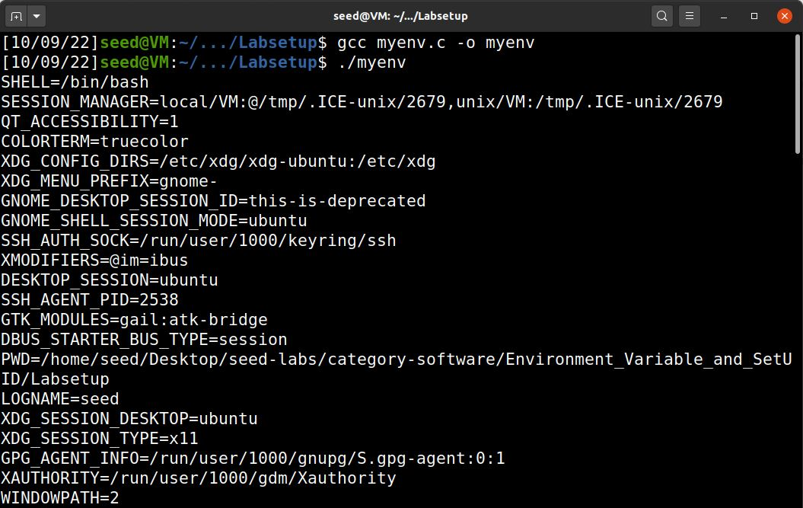

# WEEK #n

## SEEDs LAB

Link: https://seedsecuritylabs.org/Labs_20.04/Software/Environment_Variable_and_SetUID/

### Task 1
Used printenv or env to print the environment variables.

.JPG)

### Task2
- Compiled the program given (with the command **gcc myprintenv.c** and **gcc myprintenv.c**) into two processes (parent and the child process).
- Run both programs and directed the output to different files (child and parent).
- Compared the outputs files using the command **diff**. We can see the output is the same in both files.
- We can conclude that the environment variables for the parent process and the child process are the same when created by the **fork** command.

#### Program

``` c
#include <unistd.h>
#include <stdio.h>
#include <stdlib.h>
extern char **environ;
void printenv()
{
    int i = 0;
    while (environ[i] != NULL) {
    printf("%s\n", environ[i]);
    i++;
}

}
void main()
{
    pid_t childPid;
    switch(childPid = fork()) {
        case 0: /* child process */
            printenv(); ➀
            exit(0);
        default: /* parent process */
            //printenv();
            exit(0);
    }
}
```

#### Terminal

.JPG)

### Task3
- 
- 
- 
- 

#### Program

``` c
#include <unistd.h>

extern char **environ;

int main()
{
  char *argv[2];

  argv[0] = "/usr/bin/env";
  argv[1] = NULL;

  execve("/usr/bin/env", argv, environ);  

  return 0 ;
}
```

#### Terminal


