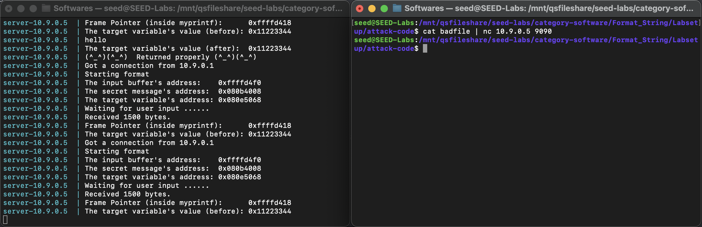

# WEEK 7

## SEEDs LAB

Link: https://seedsecuritylabs.org/Labs_20.04/Software/Format_String/

### Task 1 - Crashing the Program
- The instruction "nc 10.9.0.5 9090" compiles the given server that has de format string vulnerability.
- Adding the command "echo hello" will send the message "hello" to the server started. Doing this, we will see this message printed out by the server.



### Task2 - Printing Out the Server Program's Memory
#### Task2.A - Stack Data
- The purpose of this task is to print data of the stack. And the goal is to know how many %x format specifiers we need to use in order to print out our 4 bytes. Doing this, we will know when we get to the address where our buffer is in memory.

- As we can see below, the value after is 0x11223344.

.png)

#### Task2.B - Heap Data
- The purpose of this task is to print out the secret message stored in the heap area.

.png)

- In the picture below, we can see the file used in the server (in our case, is called "badFile"). (line 17) 

- In fact, we tried to figured out the number of %x we would need to get our hexadecimal mumber to be printed on the screen, caming to the conclusion that we would need 65 %s format specifiers in order to print our hexadecimal number. We used "%x"*63 in order to store 63 times the format specifier %x, and, at the end, we are concatenating our hexadecimal number. We have, in total, 65 bytes because we store 1 byte (8 bits) of our number encoded in the content array, then we store 63 %x format specifiers and then 1 byte for our hexadecimal number (1 + 63 + 1 = 65 bytes).

.png)

#### Program

``` c
code in c
```

#### Terminal


### Task3 (mudar -> está mal)
- (...)

#### Program

``` c
code in c
```

#### Terminal


### Task4

- (...)


#### Program

``` c
code in c
```

#### Terminal


