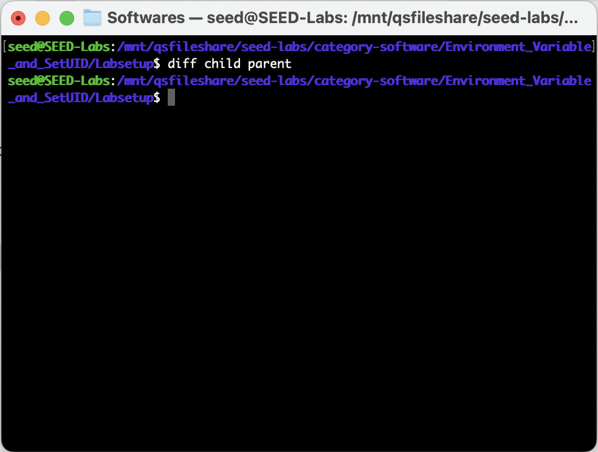

# WEEK 7

## SEEDs LAB

Link: https://seedsecuritylabs.org/Labs_20.04/Software/Environment_Variable_and_SetUID/

### Task 1
Used printenv or env to print the environment variables.

.JPG)

### Task2
- Compiled the program given (with the command **gcc myprintenv.c** and **gcc myprintenv.c**) into two processes (parent and the child process).
- Run both programs and directed the output to different files (child and parent).
- Compared the outputs files using the command **diff**. We can see the output is the same in both files.
- We can conclude that the environment variables for the parent process and the child process are the same when created by the **fork** command.

#### Program

``` c
#include <unistd.h>
#include <stdio.h>
#include <stdlib.h>
extern char **environ;
void printenv()
{
    int i = 0;
    while (environ[i] != NULL) {
    printf("%s\n", environ[i]);
    i++;
}

}
void main()
{
    pid_t childPid;
    switch(childPid = fork()) {
        case 0: /* child process */
            printenv(); ➀
            exit(0);
        default: /* parent process */
            //printenv();
            exit(0);
    }
}
```

#### Terminal


### Task3 (mudar -> está mal)
- Compiled the program myenv.c (using **gcc myenv.c -o myenv**) and ran it. 
- There was no output what so ever, because the 3rd argument passed to the function execve it's NULL. This means that the new process has no environment variables.
- In step 2, (...)
- 

#### Program

``` c
#include <unistd.h>

extern char **environ;

int main()
{
  char *argv[2];

  argv[0] = "/usr/bin/env";
  argv[1] = NULL;

  execve("/usr/bin/env", argv, environ);  

  return 0 ;
}
```

#### Terminal




### Task4

- In this task, we study how environment variables are affected when a new program is executed via the
system() function. This function is used to execute a command, but unlike execve(), which di-
rectly executes a command, system() actually executes "/bin/sh -c command", i.e., it executes
/bin/sh, and asks the shell to execute the command.
- If you look at the implementation of the system() function, you will see that it uses execl() to
execute /bin/sh; execl() calls execve(), passing to it the environment variables array. Therefore,
using system(), the environment variables of the calling process is passed to the new program /bin/sh.


#### Program

``` c
#include <stdio.h>
#include <stdlib.h>
int main()
{
system("/usr/bin/env");
return 0 ;
}
```

#### Terminal


